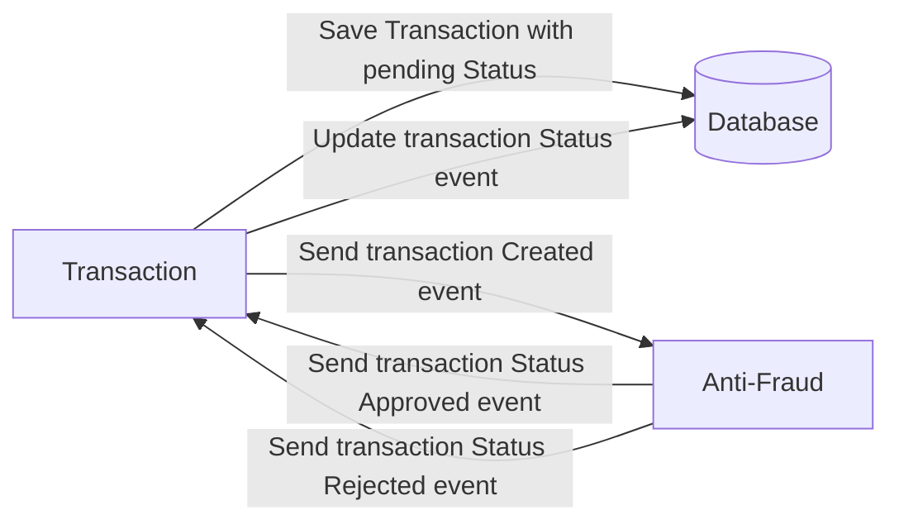

# Transaction Validator Dummy 🚀

> **New? Start here:** See the [Quick Start Guide](QUICKSTART.md) for step-by-step setup and deployment instructions.

**Transaction system with async fraud validation using Kafka + Schema Registry, one command deploy with docker & make**

A microservices event driven architecture example with key features:

- Independent microservices: At least two main services (ms-paids-bs and ms-frauds-bs), each with its own logic and implementation.
- Asynchronous communication: The services communicate via Kafka events, decoupling the flow and enabling asynchronous processing.
- Decoupled anti-fraud validation: The payments service emits a transaction event, which the fraud service consumes, validates, and responds with another event.
- Schema logging: Used to validate and version messages traveling through Kafka.
- Not pure CQRS: While there is separation of responsibilities and asynchronicity, there is no strict separation of read and write models, nor are there separate paths for commands and queries.

## Table of Contents

- [Problem](#problem)
- [Tech Stack](#tech-stack)
- [Architecture](#architecture)
- [Requirements](#requirements)
- [Installation and Setup](#installation-and-setup)
- [Start Services](#start-services)
- [API Endpoints](#api-endpoints)

---

## Problem

Every time a new financial transaction is created, it must be validated by an anti-fraud microservice. The system has three transaction states:

- ✅ **Pending**: Initial state of the transaction
- ✅ **Approved**: Transaction approved
- ❌ **Rejected**: Transaction rejected

**Business rule**: Any transaction with a value greater than 1000 must be rejected.



---

## Tech Stack

| Component           | Technology                |
| ------------------- | ------------------------- |
| **Runtime**         | Node.js                   |
| **Framework**       | NestJS                    |
| **ORM**             | Prisma                    |
| **Database**        | PostgreSQL                |
| **Message Broker**  | Apache Kafka              |
| **Schema Registry** | Confluent Schema Registry |
| **GraphQL**         | Apollo Server             |
| **REST**            | Healthchecks              |
| **Monitoring**      | Kafka UI                  |

---

## Architecture

```
┌─────────────────────────────────────────────────────┐
│           MS-Payments-BS (NestJS App)               │
│  ┌─────────────────────────────────────────────┐    │
│  │  GraphQL Server (Port 3000)                 │    │
│  │  - Create Transaction                       │    │
│  │  - Get Transaction                          │    │
│  │  - GraphQL Queries & Mutations              │    │
│  └─────────────────────────────────────────────┘    │
└─────────────────────────────────────────────────────┘
           │
           │ (Kafka Events)
           ▼
┌─────────────────────────────────────────────────────┐
│      Kafka Broker (Port 9092)                       │
│  ┌──────────────────────────────────────────────┐   │
│  │  Topic: transaction-validation-request        │   │
│  │  Topic: transaction-validation-response       │   │
│  └──────────────────────────────────────────────┘   │
└─────────────────────────────────────────────────────┘
           │
           │ (Request Validation)
           ▼
┌─────────────────────────────────────────────────────┐
│         ms-frauds-bs (Anti-Fraud Service)           │
│  - Listens to transaction-validation-request        │
│  - Publishes to transaction-validation-response     │
│  - Approves if value ≤ 1000                        │
│  - Rejects if value > 1000                         │
└─────────────────────────────────────────────────────┘
           │
           │ (Schema Validation)
           ▼
┌─────────────────────────────────────────────────────┐
│   Schema Registry (Port 8081)                       │
│  - Validates message schemas                        │
│  - Manages schema versions                          │
│  - Central schema repository                        │
└─────────────────────────────────────────────────────┘
```

## Requirements

- 🐳 **Docker Desktop** (version 20.10+)
- 🐳 **Docker Compose** (version 1.29+)
- 💾 **Disk space**: Minimum 5GB
- 🔌 **Available ports**: 3000, 5432, 8080, 8081, 9092, 2181

## Installation and Setup

For a fast and up-to-date setup, follow the **[Quick Start Guide](QUICKSTART.md)**.

---

## Start Services

### 🚀 Option 1: ALL services (Recommended)

Start the full infrastructure with a single command:

```bash
make me-happy
```

**Services started:**

- ✅ PostgreSQL (Port 5432)
- ✅ Zookeeper (Port 2181)
- ✅ Kafka (Port 9092)
- ✅ Schema Registry (Port 8081)
- ✅ Kafka UI (Port 8080)
- ✅ MS-Payments-BS (Port 3000)
- ✅ MS-Frauds-BS (Port 3001)

## API Endpoints

You can test the example requests by importing our [Postman collection](docs/TransactionValidator.postman_collection.json).
